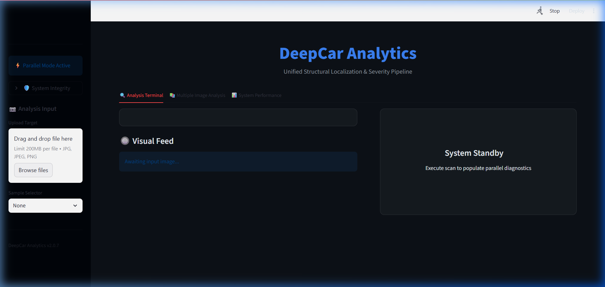
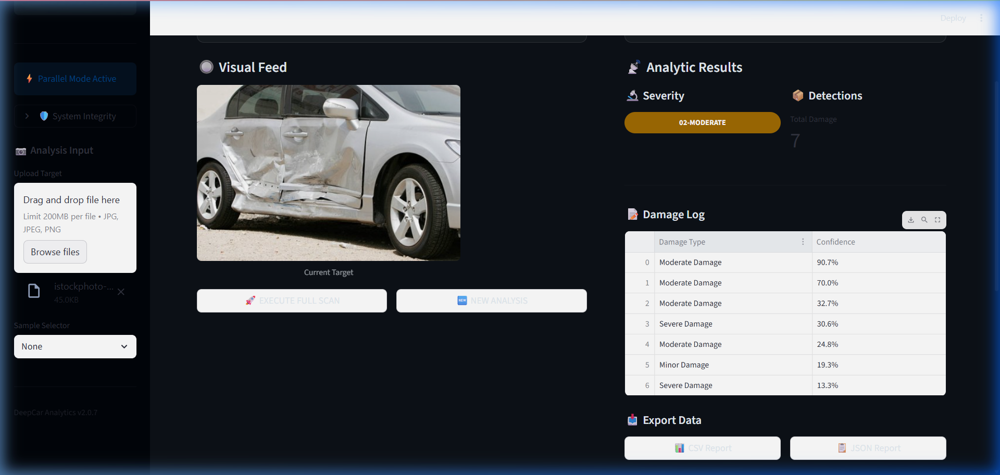
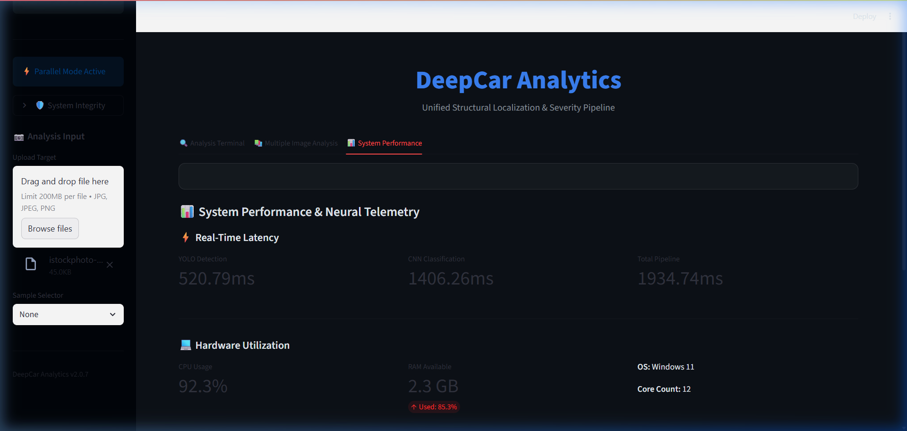
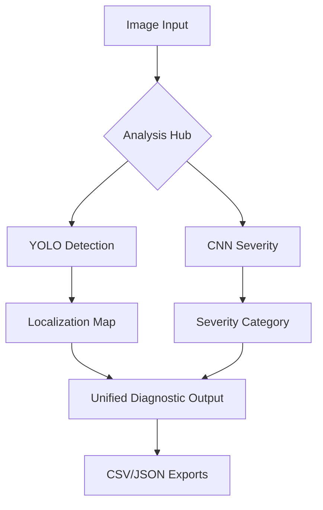

# 🚗 DeepCar Analytics
### Unified Structural Localization & Severity Pipeline


[](https://share.streamlit.io/)
[](https://www.python.org/downloads/)
[](https://opensource.org/licenses/MIT)

---

## 🌟 Overview
**DeepCar Analytics** is a cutting-edge computer vision platform designed for the automotive insurance and repair industry. By leveraging a dual-pipeline architecture of **YOLO-based Object Detection** and **CNN-based Severity Classification**, it provides instant, high-precision diagnostics of vehicle structural integrity.

---

## 🚀 Core Features

### 🔍 1. Precise Damage Localization
*   **Engine**: YOLOv12 (Latest State-of-the-Art)
*   **Function**: Identifies and bounds specific damage types including dents, scratches, glass shatters, and tire issues.
*   **Output**: High-resolution localization maps with confidence scores.

### 🔬 2. Damage Severity Classification
*   **Engine**: MobileNetV2 / ResNet50 Architecture
*   **Function**: Categorizes overall vehicle damage into Minor, Moderate, or Severe categories.
*   **Integration**: Parallel inference provides a unified diagnostic report in seconds.

### 📦 3. Advanced Batch Processing
*   **Utility**: Upload entire fleets of vehicle images and process them in a single execution.
*   **Report**: Generates comprehensive CSV and JSON exports for insurance claim pipelines.

### 📊 4. Neural Telemetry & Performance
*   **Monitoring**: Real-time tracking of inference latency, CPU utilization, and system hardware status.

---

## 🎨 User Interface

<div align="center">
  <h3>✨ Modern Analytics Dashboard</h3>
  
  <p><i>The sleek, dark-mode interface designed for professional diagnostic environments.</i></p>
</div>

<div align="center">
  <h3>🎯 Real-Time Analysis Feed</h3>
  
  <p><i>Live detection maps combined with unified severity scoring.</i></p>
</div>

<div align="center">
  <h3>🖥️ System Intelligence Hub</h3>
  
  <p><i>Hardware-aware telemetry ensuring optimal deployment performance.</i></p>
</div>

---

## 🛠️ Tech Stack & Architecture

- **Frontend**: [Streamlit](https://streamlit.io/) (High-Performance Web Framework)
- **Deep Learning**: [Ultralytics YOLO](https://ultralytics.com/), [TensorFlow](https://wwww.tensorflow.org/)
- **Image Processing**: [OpenCV](https://opencv.org/), [Pillow](https://python-pillow.org/)
- **Data Engineering**: [Pandas](https://pandas.pydata.org/), [NumPy](https://numpy.org/)



---

## ⚙️ Installation & Setup

1. **Clone the Project**
   ```bash
   git clone https://github.com/ahsitab/App_DeepCarDamage.git
   ```

2. **Environment Setup**
   ```bash
   pip install -r requirements.txt
   ```

3. **Launch the Engine**
   ```bash
   streamlit run app.py
   ```

---

## 🛡️ License & Acknowledgments
Built with ❤️ for AI-powered vehicle analysis under the **MIT License**.

- **Models**: YOLOv12, MobileNetV2
- **Data**: CarDD Dataset
- **Tools**: GitHub LFS, Streamlit Cloud

---
<p align="center"><b>DEEPCAR ANALYTICS ECOSYSTEM | v2.0.7 | STABLE</b></p>
